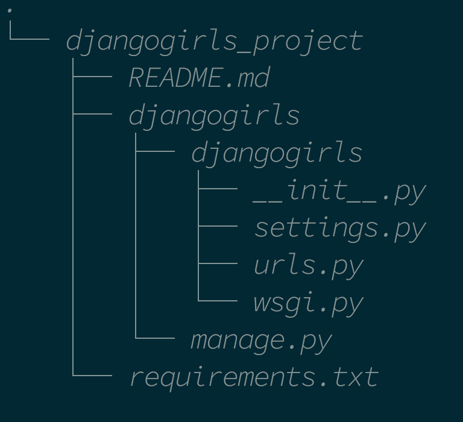

# 장고 시작하기 (1)

장고걸스 튜토리얼을 따라간다.

https://tutorial.djangogirls.org/ko/

### 환경설정

가상환경 설정을 먼저 한다.

프로젝트 폴더에 `pyenv-virtualenv` 저장한다.

```
pyenv virtualenv 3.6.2 <프로젝트 이름>
pyenv local <프로젝트 이름>
```
`.gitignore`를 설정한다.

gitignore.io 사이트에서 'macos, python, django, pycharm, linux'옵션을 입력하고 받는다.

추가로 pycharm 생성폴더 `.idea`를 무시하게 하기 위해 `.gitignore`에 `.idea/`를 추가한다.

pycharm에 들어가서 프로젝트 폴더를 실행한 뒤, 파이썬 인터프리터를 설정한다.

가상환경이 저장되어 있는 위치: `/usr/local/var/pyenv/versions/<프로젝트 이름>/bin/python`

가상환경 `pip`에 장고를 설치한다.

```
pip install django
```

`ipython`과 `django-extensions`를 설치한다.

```
pip install ipython
pip install django-extensions
```

#### `pip list` 오류 해결법

홈폴더에 `.pip` 폴더를 만들고 `.pipconf` 파일을 만든다.
그리고 다음과 같이 작성한다.

```
[list]
format=columns
```

pip가 설치 당시 환경을 기억하게 하기 위해 requirement.txt를 작성해야 한다.

```
pip freeze > requirement.txt
```

나중에 복원하기 위해서는 이렇게 쓴다.

`pip install -r requirements.txt`


### 웹 프레임워크란?

웹 애플리케이션을 만들 때 필요한 기능이 담긴 뼈대를 담아놓은 것.


### 장고 설치

```python
django-admin startproject <프로젝트 이름>
```

### 장고의 구조



메인 애플리케이션 폴더: `djangogirls`
패키지 폴더: `djangogirls`

이름에 혼동이 오니 패키지 폴더를 수정해준다.
pycharm에서 디렉토리 선택 후 `rename-refactoring`을 선택해 파일 이름을 바꾼다.


### 서버 작동

```python
python manage.py runserver
```
서버를 작동시키면 `http://127.0.0.1:8000/`으로 사이트가 작동하기 시작한다.

`python manage.py` 대신에 `./manage.py` 라고 써도 된다. 이 파일 안에 실행 경로가 적혀있기 때문이다.


### 데이터베이스 설치

데이터베이스 만들기
```python
python manage.py migrate
```

sqlite를 브라우징할 수 있는 프로그램
http://sqlitebrowser.org/

장고가 가장 주로 사용하는 SQL은 postgreSQL이다.


### 어플리케이션 설치

장고는 장고 내부에 다시 애플리케이션을 가진다.

blog 패키지를 만들자.

```python
./manage.py startapp blog
```

#### 어플리케이션 모델 설계

어플리케이션을 만든 다음에는 먼저 `settings.py`에 등록해야 한다.

```python
# Application definition

INSTALLED_APPS = [
    # Django applications
    'django.contrib.admin',
    'django.contrib.auth',
    'django.contrib.contenttypes',
    'django.contrib.sessions',
    'django.contrib.messages',
    'django.contrib.staticfiles',
    # Third-party applications
    'django_extensions', # <-- 이것도 추가해야 함!
    # User applications
    'blog', # <-- 여기에 추가
]
```

장고 프로젝트의 시간대를 미국에서 한국으로 맞추기 위해서는 `settings.py`에서 `TIME ZONE`을 수정한다.

```python
TIME_ZONE = 'Asia/Seoul'
```

그 후 `models.py`에서 어플리케이션의 데이터구조를 설계한다. 다음은 예시다.

```python
from django.conf import settings
from django.db import models


class Post(models.Model):
    author = models.ForeignKey(settings.AUTH_USER_MODEL)
    # 글쓴이 설정
    title = models.CharField(max_length=100)
    # 글 제목 설정, 최대 길이를 설정해 데이터 용량을 줄인다
    content = models.TextField(blank=True)
    # 글 내용 설정, 빈칸을 읽도록 설정한다
    created_date = models.DateTimeField(auto_now_add=True)
    # 생성일 설정, 자동 추가 옵션을 추가했다
    published_date = models.DateTimeField(blank=True, null=True)
    # 게시일 설정, 게시일은 추가하지 않아도 상관없도록 설정을 넣었다.

    # 매직 메소드를 사용해 Post 객체들이 title을 리턴하도록 설정한다.
    def __str__(self):
        return self.title

```

#### 어플리케이션 데이터베이스 저장


어플리케이션의 정보는 곧장 DB에 넣는 게 아니다. 먼저 마이그레이션 파일을 만든 뒤 마이그레이션 파일을 DB에 넣는 방식으로 진행된다.

```python
./manage.py makemigrations blog
```

그 후 마이그레이션 파일을 DB에 추가한다.

```python
./manage.py migrate blog
```

### 관리자 계정 만들기

장고는 브라우저 상에서 데이터를 관리할 수 있는 관리자 페이지를 이미 자동으로 제공하고 있다.

```
http://127.0.0.1:8000/admin
```

저곳으로 들어가면 로그인 창이 뜬다. 로그인을 하기 위해선 먼저 관리자 계정을 `manage.py`에서 만들어야 한다.

```python
./manage.py createsuperuser
```

그 후 아이디와 비밀번호를 입력하면 관리자 계정이 만들어진다. 이제 관리자 사이트로 접속할 수 있게 된다.


### 어플리케이션을 관리자 페이지에 등록

관리자 페이지에서 어플리케이션 데이터에 접근하려면 `admin.py`를 수정해주어야 한다.

```python
from django.contrib import admin

from .models import Post

# 여기에 Post를 등록해주어야 한다.
admin.site.register(Post)

```


### MVC 패턴

> Model - View - Controller pattern

- Model: Data
- View: 사용자에게 제공되는 화면
- Controller: Model과 View 사이에서 데이터를 가공하는 역할 <- urlresolver에 연결

### Request - Response 과정

1. 사용자의 요청이 server에 도달
2. server는 해당 요청 URL을 django에 전달
3. django는 전달받은 URL을 urlresolver로 분석해서 작업을 처리할 controller에 연결
4. controller는 요청을 받아 사용자에게 제공할 view(html)를 리턴
5. server는 리턴받은 응답을 사용자에게 전달

### MTV 패턴

> Model - Template - View

MVC와 같은 모델인데 이름이 다르다.


### view 만들기

`view.py`를 수정해 데이터베이스의 파일을 템플릿으로 보낼 준비를 한다.

```python
from django.shortcuts import render

from .models import Post

def post_list(request):
    posts = Post.objects.all() # <-- Post 모델의 데이터베이스를 객체화시킨다
    context = {
        'posts' : posts, # <-- 객체화된 데이터베이스를 딕셔너리의 값으로 넣는다
    }
    return render(request, 'blog/post_list.html', context)
    # 딕셔너리를 html 파일로 전송한다
```

### template 만들기

이제 사용자에게 전달될 template를 만들 차례다. 프로젝트 폴더에 `template`폴더를 만들고, 그 안에 다시 `blog` 폴더를 만든다. `template` 폴더에는 앞으로 만들 모든 어플리케이션의 html이 담길 것이므로 그 하위에 `blog`폴더를 다시 지정해준 것이다.

`blog` 폴더 안에 `post_list.html`을 만들어서 장고가 최종적으로 출력할 결과물을 만든다.

```html
<!doctype html>
<html lang="ko">
<head>
    <meta charset="UTF-8">
    <meta name="viewport"
          content="width=device-width, user-scalable=no, initial-scale=1.0, maximum-scale=1.0, minimum-scale=1.0">
    <meta http-equiv="X-UA-Compatible" content="ie=edge">
    <title>Post list</title>
</head>
<body>
     <!--view에서 넘겨받은 객체를 순회하는 for문-->
    <!--템플릿 언어라고 한다-->
    <h2>{{ post.title }}</h2>
    <div>{{ post.content|linebreaksbr}}</div>
    <br>
    <hr>
    <br>
    
    <!--for문 종료-->
</body>
</html>
```


### URL 만들기

모든 포스트에는 개별 URL이 필요하고, 그걸 만들어내는 규칙이 필요하다.

장고 어플리케이션은 클라이언트에게 요청이 들어왔을 때 url을 해석할 수 있는 규칙을 부여해야 한다.

이 규칙을 정규표현식으로 만든다.

`urls.py`에서 메인 페이지 url을 블로그 포스트 리스트로 연결짓는 식을 만든다.

```python
from django.conf.urls import url
from django.contrib import admin

from blog.views import post_list <-- 위에서 만든 view 파일 임포트

urlpatterns = [
    url(r'^admin/', admin.site.urls),
    url(r'^$', post_list) <-- 메인페이지로 접속하면 view 파일의 post_list 함수를 가져오도록 한다
]
```

### 템플릿 언어

장고 템플릿 언어는 중괄호를 이용해 사용하는 게 일반적이다.

```	python
 # for문

{{ post.title}} # 순회하는 post에서 title을 출력

 #for문 종료
```

그리고 추가로 활용하는 필터 옵션들이 더 있다.

https://docs.djangoproject.com/ko/1.11/ref/templates/builtins/

```
linebreaksbr: 객체의 줄바꿈을 <br>태그로 인식한다.
truncatewords: (int) : 객체의 단어 수가 몇 자 이상 넘어가면 말줄임표로 생략한다.
```
