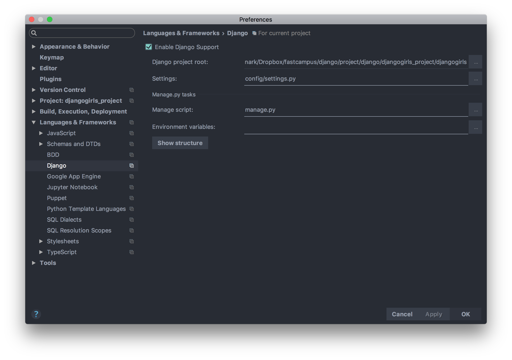

# 장고 시작하기 (2)


### 정적 파일 추가

장고 파일은 두 가지로 나뉜다.

1. 유저 업로드 파일
2. 정적 파일

정적 파일은 소스 코드로 관리되어야 한다. 정적 파일을 담을 공간을 마련하기 위해 루트 폴더 안에 `static`이란 폴더를 만들고 그 안에 부트스트랩 파일을 넣는다.

장고가 `static`을 인식하게 하기 위해 `settings.py`를 수정한다.

###### settings.py

```python
# 정적 파일을 저장할 'static' 폴더
STATIC_DIR = os.path.join(BASE_DIR, 'static')
# Django 에서 정적 파일을 검색하고 가져올 폴더 목록
STATICFILES_DIRS = [
    STATIC_DIR,
]
```

### pycharm 장고 인식



Pycharm pro 버전은 django 구문을 인식할 수 있다. 

settings > Languages & Frameworks > Django에서

`Enable Django Support`에 체크한다.

Django project root: 해당 프로젝트의 루트 폴더

settings: `settings.py` 파일

manage script: `manage.py` 파일

이렇게 세팅하면 Pycharm이 프로젝트를 참조하게 된다.


### 부트스트랩 추가

###### base.html

```html

<!doctype html>
<html lang="ko">
<head>
    <meta charset="UTF-8">
    <meta name="viewport"
          content="width=device-width, user-scalable=no, initial-scale=1.0, maximum-scale=1.0, minimum-scale=1.0">
    <meta http-equiv="X-UA-Compatible" content="ie=edge">
    <!--정적 파일을 참조하는 템플릿 static 태그 (staticfiles_dirs의 path를 기준으로 상대경로-->
    <link rel="stylesheet" href="">
    <title>Post list</title>
</head>
...
```

### html 상속받기

페이지를 만들 때마다 같은 html을 계속 복사해서 사용하면 비효율적이다. 그래서 `base.html`을 만들고 나머지 파일들은 그것을 참조하는 식으로 설계를 바꾸기로 하자.

###### base.html
```
<!--base.html-->
...
<body>
<h2 class="blog-title">
    <div class="container"><a href="/">HuskyHoochu</a></div>
</h2>
<!--장고 템플릿 언어-->
<div class="container">
    <!--'content' 라는 이름으로 block 구역 지정-->
    
    
</div>
</body>
</html>
```

나머지 html 파일들은 이렇게 바꿔준다.


###### post_list.html
```
<!--base.html을 확장한다-->

<!--block 구역 시작-->
    <div class="post-container">
        
            <div class="post">
                <h3 class="post-title"><a href="">{{ post.title }}</a></h3>
                <p class="content">{{ post.content|linebreaksbr|truncatewords:50 }}</p>
                <p class="right-text">{{ post.published_date }} <strong> | Published</strong></p>
                <p class="right-text">{{ post.author.username }} <strong> | Author</strong></p>
                <hr>
            </div>
        
    </div>
<!--block 구역 끝-->
```

### URL 정규표현식

각 포스트의 세부 화면을 보여주는 `post_detail.html`을 만든 뒤, 이 각 포스트를 출력하게 하려면 포스트의 고유한 `primary key`를 이용해야 한다.

###### view.py

```python
def post_detail(request, pk): #<-- 파라미터 값으로 pk를 받는다
    # get에 실패했을 때 발생하는 예외
    try:
        post = Post.objects.get(pk=pk) #<--주어진 pk값을 지닌 포스트 객체를 출력한다
    except Post.DoesNotExist:
        return HttpResponse('No Post', status=404)
    else:
        context = {
            'post': post,
        }
    return render(request, 'blog/post_detail.html', context)

```

그 다음, `urls.py`에서 각 포스트에 맞는 주소를 매칭해줄 수 있는 동적 URL을 만들어야 한다.


#### url 동적으로 구성하기

###### urls.py
```python
urlpatterns = [
	...
    # 디테일 페이지 만들기
    # post/<숫자 1개 이상>/ 이 가능하도록 정규표현식 작성
    # 해당 숫자는 그룹으로 감싸고 'pk(primary key)'라는 그룹명을 지정
    url(r'^post/(?P<pk>\d+)/', post_detail, name='post_detail'),
]

```

참고 : [정규표현식 질문](http://hashcode.co.kr/questions/1440/%EC%A0%95%EA%B7%9C%ED%91%9C%ED%98%84%EC%8B%9D-%EC%A7%88%EB%AC%B8%EC%9E%85%EB%8B%88%EB%8B%A4)

URL:
- 매칭 패턴: `r'^post/(?P<pk>\d+)/'`
	- `?P<pk>`: 매칭되는 그룹에 `pk`라는 이름을 붙여준다.
	- `\d`: 숫자 0-9와 동일
	- `+`: 앞 문자가 1개 이상인 것
- 컨트롤러: `post_detail()`
- URL의 이름: `post_detail`

1. 요청이 왔을 경우
	- URL이 매칭되는 패턴을 찾는다
	- 해당 패턴에 할당된 컨트롤러가 작업을 처리
2. 특정 컨트롤러의 요청을 받을 수 있는 URL을 생성하고자 할 경우
	- 특정 컨트롤러는 이름이 바뀔 수 있음 (또는 다른 컨트롤러가 배정될 수 있음)
	- URL 이름을 기준으로, 매칭 패턴을 역으로 사용해서 문자열을 생성


### 글쓰기 기능 구현

지금까지는 관리자 페이지에서만 글을 쓸 수 있었다. 그러나 블로그 자체적으로 글을 쓸 수 있도록 기능을 추가해보자.

먼저 `post_add()` 함수를 만든 다음, 함수를 구현하는 `post_form.html`을 만들고 마지막으로 html에 URL을 부여해주도록 하자.

###### views.py
```python
def post_add(request):
	context = {
    }
	return render(request, 'blog/post.html', context)

```
###### post_form.html

```html

<!--base.html에서 확장-->

<!--컨텐츠 시작-->
    <div class="post-container">
        <h3 class="post-title">글쓰기</h3>
        <!-- 여기서부터 입력창 시작-->
        <form action="" method="post" class="form-horizontal">
            <!--html에서 입력을 받을 때 해킹 공격에 대비하기 위한 보안 솔루션-->
            <div class="form-group"> <!--제목 입력창-->
                <label for="inputEmail3" class="col-sm-2 control-label">제목</label>
                <div class="col-sm-10">
                    <input name="title" class="form-control" id="inputEmail3" placeholder="제목">
                </div>
            </div>
            <div class="form-group"> <!-- 내용 입력창-->
                <label for="inputEmail3" class="col-sm-2 control-label">내용</label>
                <div class="col-sm-10">
                    <textarea name="content" class="form-control" rows="20" placeholder="내용"></textarea>
                </div>
            </div>
            <div class="form-group"><!--확인 버튼-->
                <button type="submit" class="btn btn-default">글쓰기</button>
            </div>
        </form>
    </div>

```

###### urls.py

```python
urlpatterns = [
	url(r'^post/add/', post_add, name='post_add')
]
```

#### 디버그 기능을 통해 글쓰기 제목과 내용 확인하기

이런 식으로 코드를 짠 뒤, 입력창에서 글을 입력하면 `post_add()` 함수로 POST 요청이 들어온다. 이것은 pycharm의 디버그 기능을 통해 확인할 수 있다.

이 POST 요청을 받아들이기 위해선 `request.POST`를 사용한다. `request.POST`는 사용자가 입력한 내용을 딕셔너리 타입으로 저장하고 있다.

`post_form.html`에서 입력창에 적어놓은 `name` 속성이 키가 되고, 거기에 실제로 입력된 내용이 값이 된다.


###### views.py
```python
from django.contrib.auth import get_user_model
from django.http import HttpResponse

from django.shortcuts import render

User = get_user_model()

from .models import Post


def post_add(request):
        title = request.POST['title']
        # title 값을 받아온다
        content = request.POST['content']
        # content 값을 받아온다
        author = User.objects.get(username='lanark')
        # Post 클래스에서 author가 기본값이었으므로 이것도 받아온다.
        # 이제 클래스 객체를 정의한다.
        post = Post(
            author=author,
            title=title,
            content=content
        )
        post.publish() #<-- 내용을 저장한다
        # 문자열 형태로 전송한다
        return HttpResponse(f'{post.title}, {post.content}')
```

`publish()`함수를 통해 글쓴 내용은 실제로 데이터베이스에 저장된다.


### 게시글 발행/미발행 상태로 만들기

published_date를 조절해서 블로그 상에 글을 공개할지 말지를 결정할 수 있도록 해보자.

`Post` 클래스에 `publish()`와 `hide()` 함수를 추가하자.

##### models.py
```python
from django.utils import timezone

 def publish(self):
        """
        게시글을 발행상태로 만든다
        자신의 published_date를 timezone.now()로 할당
        이후 self.save()를 호출
        :return:
        """
        self.published_date = timezone.now()
        self.save() #<--django에 기본으로 담겨 있는 함수

def hide(self):
        """
        게시글을 미발행상태로 만든다
        자신의 published_date를 None으로 할당
        이후 Self.save()를 호출
        :return:
        """
        self.published_date = None
        self.save()
```

이렇게 세팅한 뒤 `shell_plus`를 이용하면 관리자 페이지에서 수정하지 않고도 직접 데이터의 발행 여부를 결정지을 수 있다.

```
./manage.py shell_plus

p = Post.objects.first()

p.publish() #<-- 이렇게 하면 발행시간이 현재 시간으로 설정된다

p.hide() #<-- 이렇게 하면 발행시간이 삭제되면서 미발행 상태가 된다
```

메인 사이트에서 미발행 글을 감추게 하고 싶다면 `views.py`를 수정하면 된다.

###### views.py

```python
# post_list view가 published_date가 존재하는 Post목록만 보여주도록 수정
posts = Post.objects.filter(published_date__isnull=False)
```
발행 순서를 조절할 수도 있다. 다음은 생성일 기준으로 최신 글이 위로 올라오게 할 때 사용하는 코드다.

```python
 posts = Post.objects.order_by('-created_date')
```